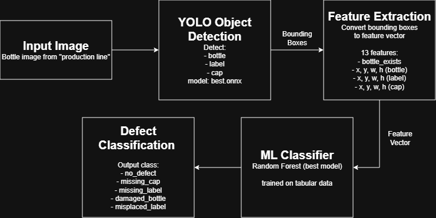
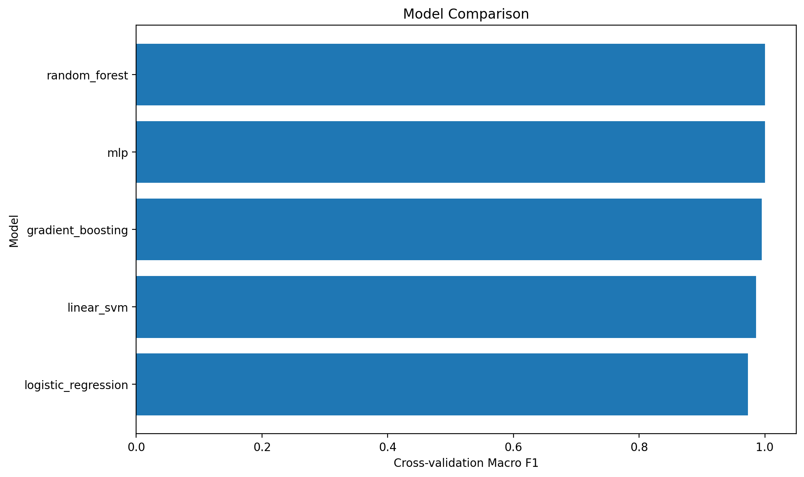
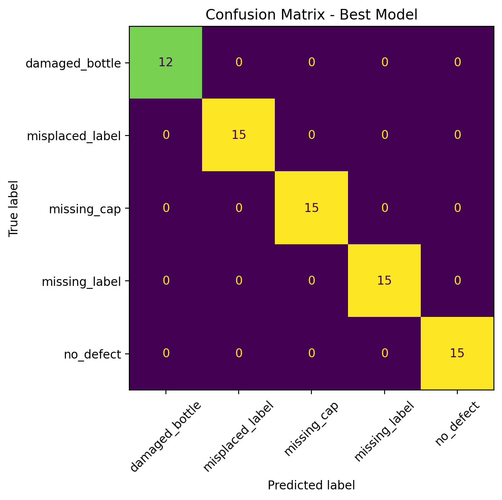
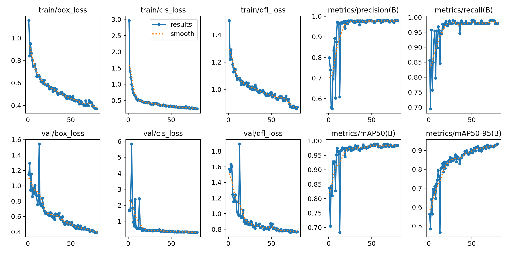
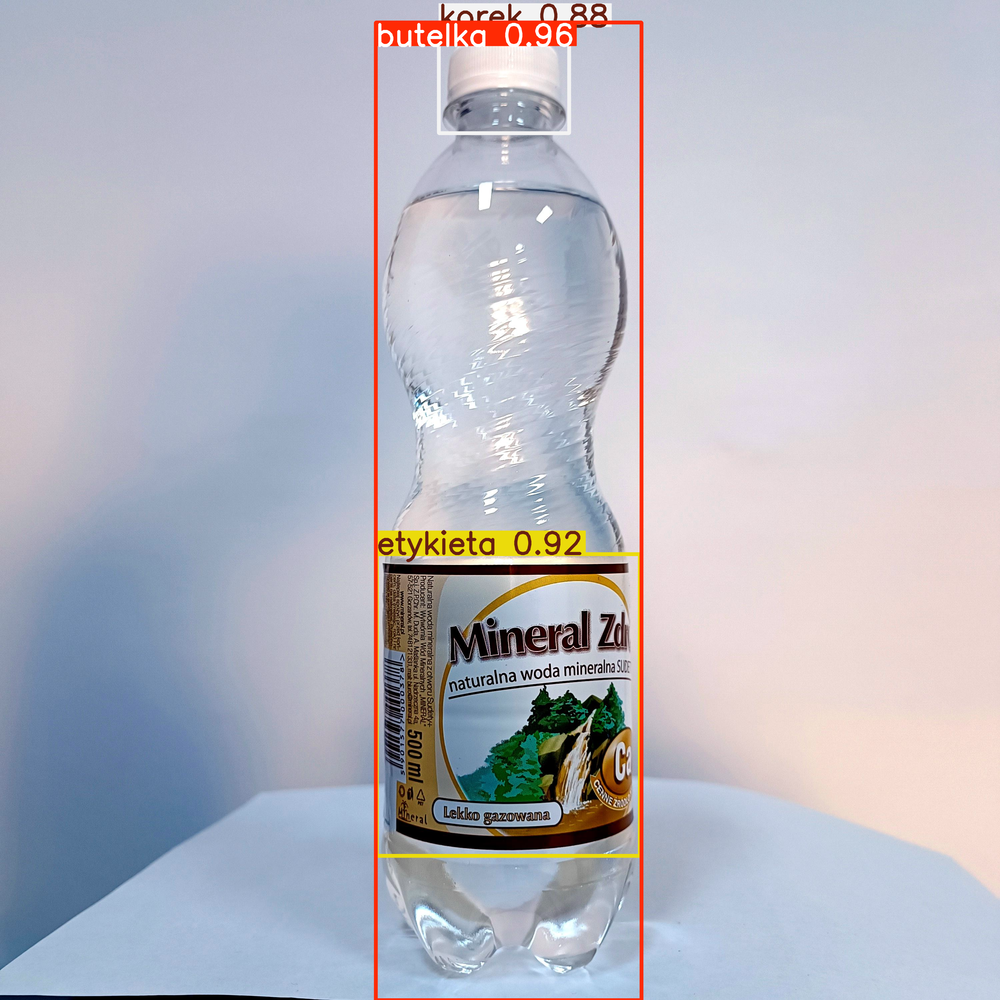
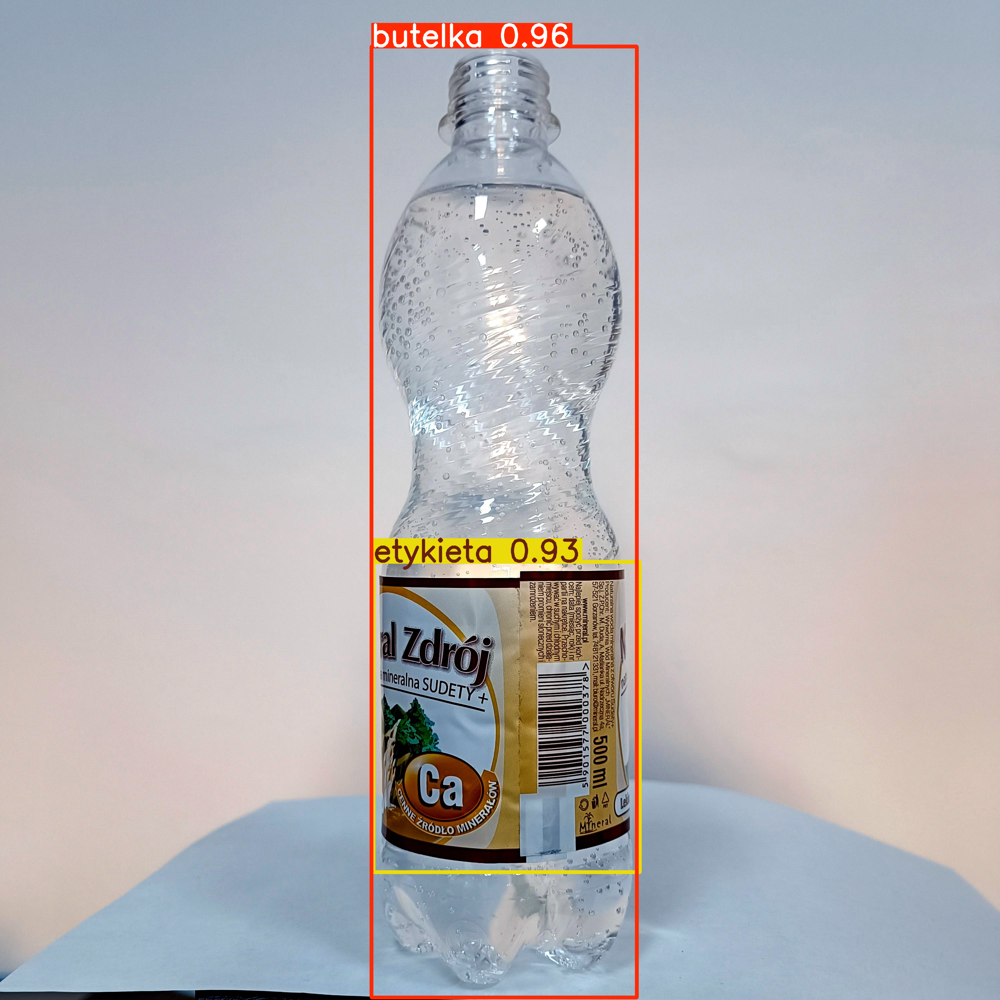
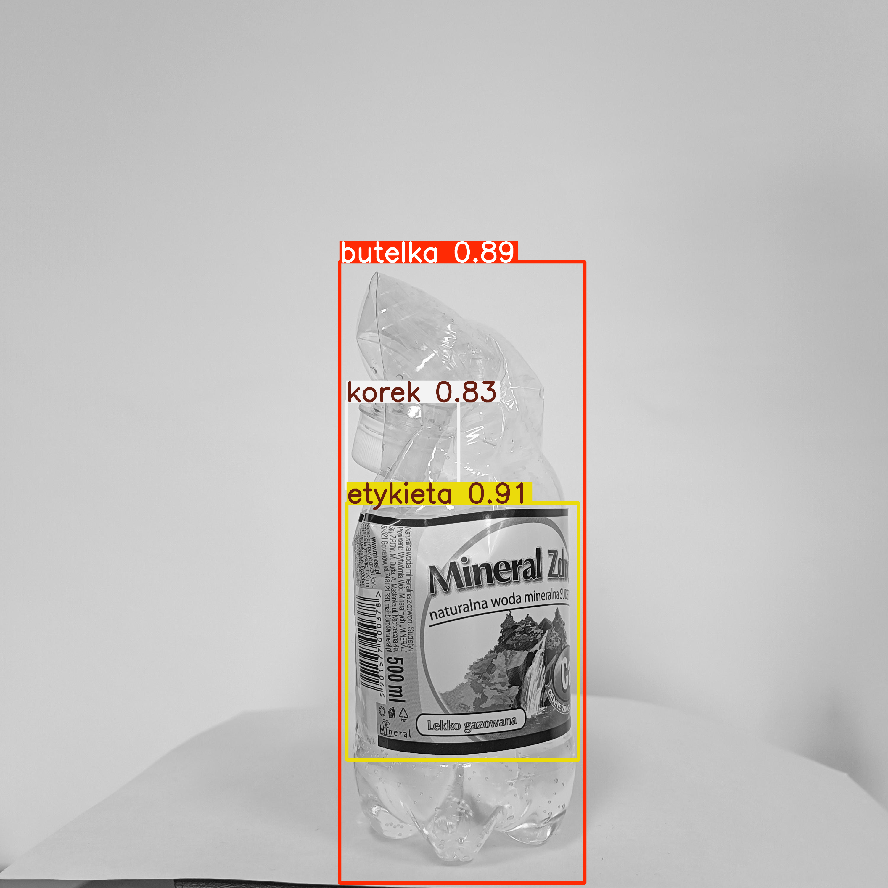
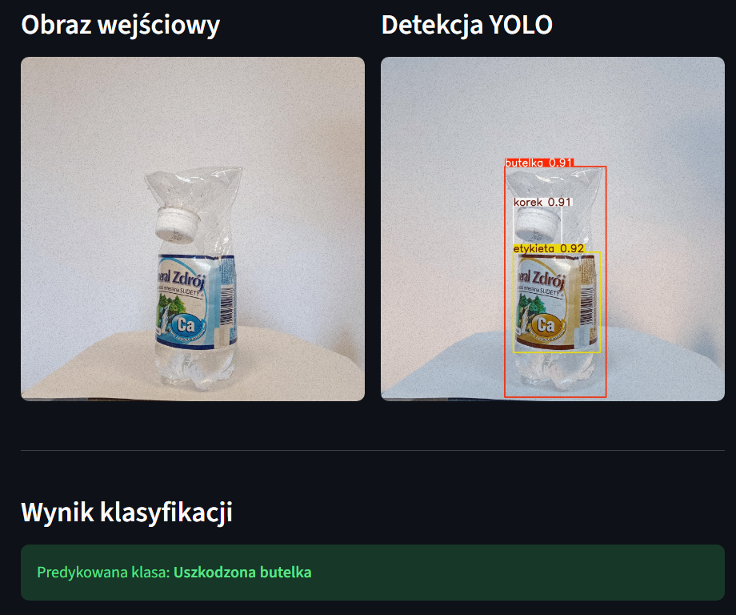

# Bottle Defect Detection

<p align="center">
  Hybrid computer vision project for bottle quality inspection using YOLO object detection, feature engineering, and machine learning classification.
</p>

<p align="center">
  
</p>

---

## 🚀 Project Highlights

* End-to-end machine learning pipeline
* YOLO-based object detection (bottle, label, cap)
* Feature engineering from bounding box geometry
* Comparison of multiple classification models
* Streamlit web application for interactive testing

---

## 💡 Business Problem

In industrial production lines, product defects such as missing caps or labels can lead to rejected products, financial losses, and quality issues.

Manual inspection is:

* slow
* inconsistent
* difficult to scale

This project simulates an automated quality control system using computer vision and machine learning.

---

## 🧠 Project Overview

The system works in two stages:

1. YOLO detects:

   * bottle
   * label
   * cap

2. Machine learning model classifies the defect:

   * no_defect
   * missing_cap
   * missing_label
   * damaged_bottle
   * misplaced_label

---

## 🔍 My Contribution

* designed hybrid pipeline (YOLO + ML)
* engineered features from bounding boxes
* compared multiple models
* selected best classifier
* built Streamlit application
* structured project for portfolio

---

## ⚙️ Pipeline

<p align="center">
  
</p>

1. Input image
2. YOLO detection
3. Feature extraction (13 features)
4. ML classification
5. Final prediction

---

## 📦 Dataset

### Object detection

* ~3000 augmented images
* annotated in Roboflow
* classes: bottle, label, cap

### Classification

* ~500 samples
* ~100 per class
* stored in CSV files

Each row contains:

* x_center, y_center, width, height
  (for bottle, label, cap)

---

## 🧮 Feature Engineering

13 features:

* bottle_exists
* bottle_x, bottle_y, bottle_w, bottle_h
* label_x, label_y, label_w, label_h
* cap_x, cap_y, cap_w, cap_h

---

## 🤖 Models Compared

* Logistic Regression
* Linear SVM
* Random Forest
* Gradient Boosting
* MLP

Best model: **Random Forest**

---

## 📊 Model Comparison

<p align="center">
  
</p>

<p align="center">
  
</p>

<div align="center">

| model                | cv_f1_macro_mean | cv_f1_macro_std | cv_bal_acc_mean | cv_acc_mean |
|----------------------|------------------|------------------|------------------|-------------|
| random_forest        | 1.0              | 0.0              | 1.0              | 1.0         |
| mlp                  | 1.0              | 0.0              | 1.0              | 1.0         |
| gradient_boosting    | 0.9953           | 0.0094           | 0.9953           | 0.9951      |
| linear_svm           | 0.9861           | 0.0125           | 0.9846           | 0.9877      |
| logistic_regression  | 0.9732           | 0.0125           | 0.9711           | 0.9753      |

</div>


---

## ⚠️ Note on Results

The model achieved near-perfect results due to:

* small dataset
* strong feature separability

In real-world scenarios, more data would be required.

---

## 🧪 YOLO Training

Files available in:
training/yolo_training

<p align="center">
  
</p>

---

## 🖼️ Example Predictions

<p align="center">
  
  
  
</p>

---

## 💻 Streamlit App

<p align="center">
  
</p>

---

## ▶️ How to Run

### 1. Clone repository

```bash
git clone https://github.com/Maueeze/Bottle-defect-detection.git
cd Bottle-defect-detection
```

---

### 2. Install dependencies

```bash
pip install -r requirements.txt
```

---

### 3. Prepare YOLO model

The YOLO model (`best.onnx`) is **not included** due to file size limitations.

You have two options:

---

#### Option A — Use existing model

If you already have `best.onnx`, place it here:

```
models/best.onnx
```

---

#### Option B — Train and export model

1. Open notebook:

```
training/train_yolo.ipynb
```

2. Run all cells to train the model

3. Export model to ONNX:

```python
best_model.export(format="onnx")
```

4. Move exported file to:

```
models/best.onnx
```

---

### 4. Run application

```bash
streamlit run app/streamlit_app.py
```

---

### 5. Test with sample images

Example images are available in:

```
data/sample_images/
```

Upload them in the Streamlit app to see predictions.


## 📁 Structure

```
app/
src/
training/
scripts/
data/
models/
assets/
```

---

## 🛠️ Tech Stack

* Python
* Streamlit
* YOLO (Ultralytics)
* ONNX Runtime
* Scikit-learn
* Pandas / NumPy

---

## 📈 Skills

* computer vision
* machine learning
* feature engineering
* model evaluation
* deployment

---

## 🔮 Future Work

* bigger dataset
* real-time video
* deep learning classifier
* deployment online
